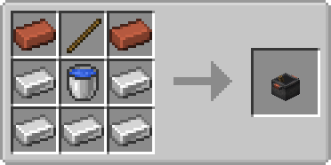

# Farmer's Delight x No Tree Punching Cooking Pot
Re-adds a compat recipe between [Farmer's Delight](https://modrinth.com/mod/farmers-delight) and [No Tree Punching](https://modrinth.com/mod/no-tree-punching) that replaced the wooden shovel with a stick when crafting a cooking pot.

This recipe is missing on Forge 1.20, and absent on Fabric (for [Farmer's Delight Refabricated](https://modrinth.com/mod/farmers-delight-refabricated) or [Farmer's Delight \[Fabric\]](https://modrinth.com/mod/farmers-delight-fabric))

To bring back the campfire recipe (to craft the stove, or for other reasons), check out [Craftable Campfire](https://modrinth.com/datapack/craftable-campfire)